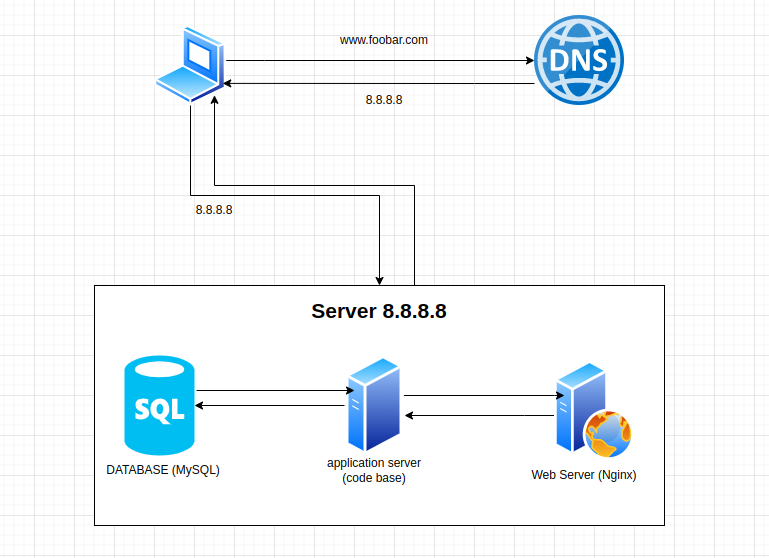

# Task 0

## Specifics About This Infrastructure

- **What is a server:** a server is a piece of computer hardware or software that provides functionality for other programs or devices, called "clients".
- **What is the role of the domain name:** a domain name is a human readable address of the website, that identify a server with a human readable text for an IP address in this case the domain name is `www.foobar.com`
- **What type of DNS record www is in www.foobar.com: **A DNS record is a mapping of a domain name to an IP address. In this case, it is a `cname`.
- **What is the role of the web server:** web server is to store, process, and deliver requested information or webpages to end users (HTML, JSON, etc.) over the protocol HTTP.
- **What is the role of the application server:** the role of the application server is to generate dynamic contents by executing server side code such as PHP, Python etc.
- **What is the role of the database:** the role of a database is to manage website's data, such as user accounts, products, and orders.
- **What is the server using to communicate with the computer of the user requesting the website:** the server communcates through HTTP protocol

## Issues:

- **SPOF:** If the server fails, the website will be unavailable.

- **Downtime when maintenance needed:** If the server needs to be updated or patched, it will need to be taken offline, which will cause the website to be unavailable.

- **Cannot scale if too much incoming traffic:** If the website receives too much traffic, the server may not be able to 
  handle it and the website will become slow or unavailable.
