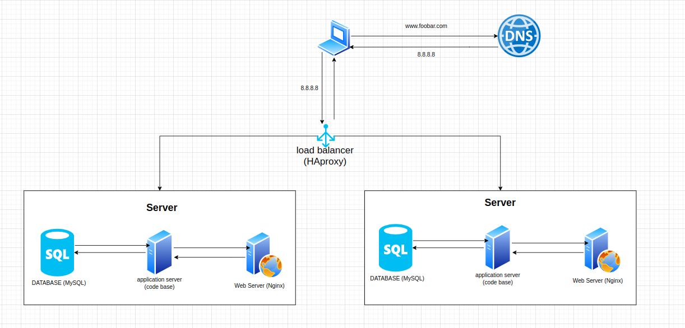

# Task 1

## Specifics About This Infrastructure

- **For every additional element, why you are adding it:** adding a new server so that we can be able to add a load balancer to handle too much incoming traffic and also enable us to eliminate a single point of failure which could occur by having one server
- **What distribution algorithm your load balancer is configured with and how it works:** The load balancer is also configured in an active-active setup. This 
  means that both web servers are running and responding to requests 
  simultaneously. If one web server fails, the other web server will 
  continue to handle requests.
- **Is your load-balancer enabling an Active-Active or Active-Passive setup, explain the difference between both:** the load balancer enables an active active setup where both nodes are actively running the same kind of service simultaneously, while in an active passive setup, not all nodes are going to be active, in the case of tow nodes, if the first node is aleady active, the second node must be passive or on standby.
- **How a database Primary-Replica (Master-Slave) cluster works:** The database is configured as a primary-replica cluster. This means that
   there is one primary node and one replica node. The primary node is the
   main database server and it is responsible for all writes. The replica 
  node is a copy of the primary node and it is responsible for reads.
- **What is the difference between the Primary node and the Replica node in regard to the application:** The difference between the primary node and the replica 
  node in regard to the application is that the primary node is the only 
  node that can be written to. The replica node can only be read from.

## Issues:

- **Where are SPOF:** The load balancer is a single point of failure. If the load balancer 
  fails, all traffic will be directed to one of the web servers, which 
  could overload the web server and cause it to fail.

- **Security issues (no firewall, no HTTPS):** Major security issues involve having the
  application communicate over HTTP protocol that is not secure and can allow an attacker (who may be in the middle) to view sensitive information (since HTTP transfers plain texts) like passwords. Also since the application doesn’t have a firewall, This can allow an attacker to perform a denial of service attack(DOS or DDOS) that may cause a major downtime in the system, or allow a malicious attacker to breach the system exploiting unknown open ports and perform data exfiltration.

- **No monitoring:** There is no monitoring in place, so there is no way to know if the 
  infrastructure is working properly or if there are any problems.
