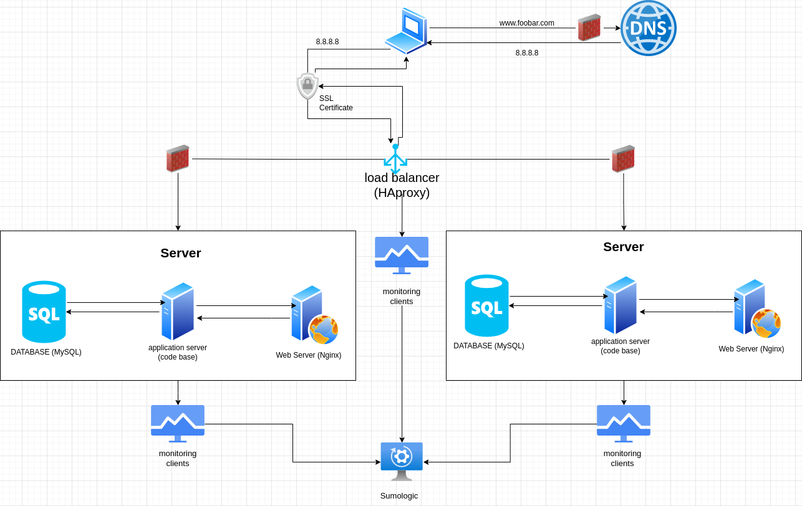

# Task 2

## Specifics About This Infrastructure

- **For every additional element, why you are adding it:** we have added three new
  components; a firewall for each server to protect them from being attacked and exploited, 1 SSL certificate to server www.foobar.com over HTTPS and three monitoring clients that will collect logs and send them to our data collector Sumologic.
- **What are firewalls for:** The firewalls are added to protect the infrastructure from attacks from the internet. The first firewall is located in front of the DNS server to protect the DNS server from attacks. The second firewall is located in front of the load balancer to protect the load balancer from attacks. The third firewall is located in front of the database server to protect the database server from attacks.
- **Why is the traffic served over HTTPS:** because previously the traffic was passed over Hypertext Transfer Protocol (HTTP) which transfers data in plain text while HTTPS is secure where the data is encrypted using Transfer Layer Security (TLS).
- **What monitoring is used for:** it provides the capability to detect and diagnose any web application performance issues proactively
- **How the monitoring tool is collecting data:** it collects logs of the application server, MySQL Database and Nginx web server. A log in a computing context is the automatically produced and time-stamped documentation of events relevant to a particular system.
- **Explain what to do if you want to monitor your web server QPS:** To monitor your web server QPS, you can use a monitoring tool that 
  supports this metric. The monitoring tool will collect data about the 
  number of requests that are being processed by the web server per 
  second. This data can then be used to track the performance of the web 
  server and identify any bottlenecks.

## Issues:

- **Why terminating SSL at the load balancer level is an issue:** Terminating SSL at the load balancer level is an issue 
  because it means that all traffic is unencrypted between the load 
  balancer and the web servers. This could allow an attacker to intercept 
  the traffic and steal sensitive data.

- **Why having only one MySQL server capable of accepting writes is an issue:** because once it is down it means do data can be added or updated meaning some features of the application won’t work.

- **Why having servers with all the same components (database, web server and application server) might be a problem:** Having servers with all the same components (database, web
   server and application server) might be a problem because if one server
   fails, all of the components will be unavailable.
