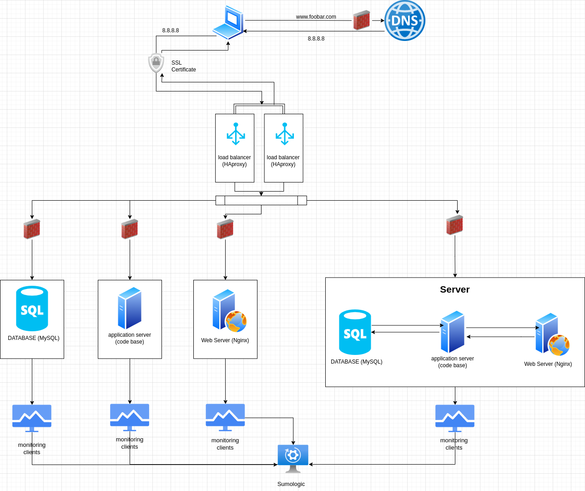

# Task 3

## Specifics About This Infrastructure

- **For every additional element, why are adding it:** we have added one server and one load balancer. Adding the new server has allowed us to separate each component (web server; Nginx, Application server; code base and Database; MySQL) in there own server and yet having one extra server with all the components to serve as a backup if any of the components or server fails. Each server is being monitored and has a firewall. We have also added an extra load balancer that will assist in handling more traffic across the whole infrastructure.
